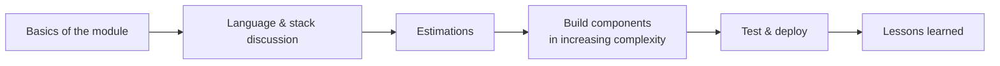

# 🗺️ Roadmap

Back to [[Home]]

Learning happens by **building**. Each module follows the same flow (see [[How this vault works]]):

## Track 1 — System design modules
| # | Module | Status | Key concepts |
|---|--------|--------|--------------|
| 01 | [[TinyURL]] | 🟡 Not started | [[Hashing]], [[Base62 Encoding]], [[Caching]] |

## Track 2 — Event streaming & messaging
Planned: compare platforms, internals, advanced topics.
- [[Kafka]]
- [[RabbitMQ]]
- [[Redis]]
- [[AWS SQS]]

## Track 3 — Fundamentals (concept by concept)
Each concept gets: advantages, disadvantages, tech stacks, code. Notes live in `Concepts/` and are linked from every module that uses them.
